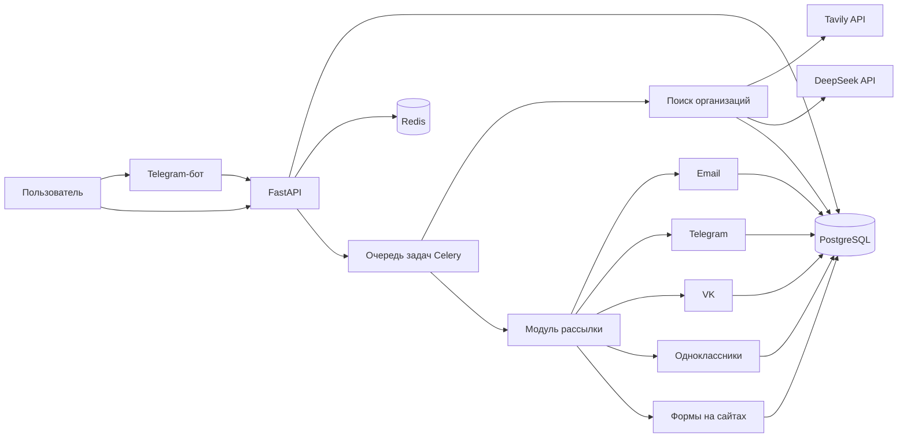

# Research Agent

Интеллектуальная система для поиска организаций, сбора контактных данных и автоматизации персонализированных рассылок через несколько каналов связи.

Research Agent формирует поисковые запросы, находит потенциальных получателей, проверяет источники, сохраняет контакты в базе данных и распределяет отправку сообщений между email, Telegram, VK, Одноклассниками и формами обратной связи на сайтах.

---

## Возможности

* 🔎 автоматический поиск организаций по заданным параметрам;
* 🧠 генерация и планирование поисковых запросов с помощью LLM;
* 🌐 поиск информации через Tavily API;
* 📇 сбор и хранение контактных данных организаций;
* ✅ проверка источников найденной информации;
* ✉️ отправка писем через SMTP;
* 💬 отправка сообщений через Telegram;
* 🔵 автоматизация взаимодействия с VK;
* 🟠 автоматизация взаимодействия с Одноклассниками;
* 📝 отправка заявок через формы обратной связи на сайтах;
* 🤖 Telegram-бот для управления системой;
* ⚙️ REST API на FastAPI;
* 📬 очередь и планирование рассылок;
* 🚦 отдельные лимиты для каждого канала;
* 📊 сбор статистики по поиску и рассылкам;
* 🔁 фоновые задачи через Celery;
* 🗄️ хранение данных в PostgreSQL;
* 🐳 полноценный запуск через Docker Compose;
* 🧪 режим безопасного запуска без реальной отправки сообщений.

---

## Стек технологий

| Категория                | Используется           |
| ------------------------ | ---------------------- |
| Язык                     | Python 3.13            |
| API                      | FastAPI                |
| Telegram-бот             | aiogram                |
| Telegram-клиент          | Telethon               |
| AI                       | DeepSeek API           |
| Веб-поиск                | Tavily API             |
| Фоновые задачи           | Celery                 |
| Брокер очередей          | Redis                  |
| База данных              | PostgreSQL             |
| Миграции                 | Alembic                |
| Автоматизация браузера   | Playwright             |
| HTTP-клиенты             | HTTPX, aiohttp         |
| Конфигурация             | Pydantic Settings      |
| Логирование              | Loguru                 |
| Тестирование             | pytest, unittest       |
| Управление зависимостями | uv                     |
| Контейнеризация          | Docker, Docker Compose |

---

## Как работает система



Основной процесс состоит из нескольких этапов:

1. Пользователь создаёт или запускает поисковую задачу.
2. AI-модуль формирует набор поисковых запросов.
3. Система получает результаты из открытых источников.
4. Найденные контакты проверяются и сохраняются в PostgreSQL.
5. Для каждого контакта определяется подходящий канал связи.
6. Задача отправки помещается в очередь Celery.
7. Отдельные воркеры выполняют отправку с учётом лимитов и рабочего времени.
8. Результаты и ошибки сохраняются для последующего анализа.

---

## Архитектура проекта

```text
research-agent/
├── agent/
│   ├── tools/
│   └── core.py
│
├── api/
│   ├── client.py
│   └── main.py
│
├── config/
├── database/
├── schemas/
├── scripts/
│
├── services/
│   ├── channel_sender.py
│   ├── communication_service.py
│   ├── contact_channels.py
│   ├── contact_form_service.py
│   ├── contact_service.py
│   ├── delivery_channel_resolver.py
│   ├── email_sender.py
│   ├── invitation_generator.py
│   ├── mailing_queue_service.py
│   ├── mailing_service.py
│   ├── ok_service.py
│   ├── search_query_planner.py
│   ├── search_run_service.py
│   ├── source_verification.py
│   ├── statistics_service.py
│   ├── telegram_service.py
│   └── vk_service.py
│
├── telegram/
├── tests/
├── utils/
│
├── worker/
│   └── celery_app.py
│
├── .env.example
├── alembic.ini
├── docker-compose.yaml
├── Dockerfile
├── main.py
├── pyproject.toml
└── uv.lock
```

### Назначение основных модулей

| Модуль      | Назначение                                       |
| ----------- | ------------------------------------------------ |
| `agent/`    | Логика AI-агента и подключаемые инструменты      |
| `api/`      | REST API и внутренний API-клиент                 |
| `config/`   | Настройки приложения                             |
| `database/` | Модели, подключение и работа с PostgreSQL        |
| `schemas/`  | Pydantic-схемы запросов и ответов                |
| `services/` | Основная бизнес-логика приложения                |
| `telegram/` | Telegram-бот, обработчики и интерфейс управления |
| `worker/`   | Celery-приложение и фоновые задачи               |
| `tests/`    | Модульные и интеграционные тесты                 |
| `scripts/`  | Вспомогательные сценарии запуска и настройки     |

---

## Требования

Для запуска через Docker понадобятся:

* Git;
* Docker;
* Docker Compose;
* API-ключ DeepSeek;
* API-ключ Tavily;
* Telegram Bot Token;
* учётные данные SMTP;
* при необходимости — авторизованные сессии Telegram, VK и Одноклассников.

Для локального запуска без Docker дополнительно потребуются:

* Python 3.13 или новее;
* `uv`;
* PostgreSQL;
* Redis;
* установленный браузер Playwright.

---

## Быстрый запуск через Docker

### 1. Клонирование репозитория

```bash
git clone https://github.com/aurusxd/research-agent.git
cd research-agent
```

### 2. Создание файла конфигурации

Linux или macOS:

```bash
cp .env.example .env
```

Windows PowerShell:

```powershell
Copy-Item .env.example .env
```

Заполните созданный файл `.env`.

### 3. Сборка контейнеров

```bash
docker compose build
```

### 4. Применение миграций

```bash
docker compose run --rm migrations
```

### 5. Запуск системы

```bash
docker compose up -d
```

### 6. Проверка состояния

```bash
docker compose ps
```

После запуска API будет доступен по адресу:

```text
http://localhost:8000
```

Документация Swagger:

```text
http://localhost:8000/docs
```

Альтернативная документация ReDoc:

```text
http://localhost:8000/redoc
```

---

## Конфигурация

Создайте `.env` на основе `.env.example`.

```env
# AI и поиск
DEEPSEEK_API_KEY=
TAVILY_API_KEY=

# Основной Telegram-бот
BOT_TOKEN=

# Ключ для внутренних API-запросов
INTERNAL_API_KEY=

# PostgreSQL
POSTGRES_USER=
POSTGRES_PASSWORD=
POSTGRES_DB=
POSTGRES_HOST=db
POSTGRES_PORT=5432

# SMTP Mail.ru
MAILRU_SMTP_USER=
MAILRU_SMTP_PASSWORD=
MAILRU_SMTP_FROM_NAME=
MAILRU_FORCE_IPV4=true

# Telegram-рассылка
TELEGRAM_OUTREACH_BOT_TOKEN=
OPERATOR_TELEGRAM_CHAT_ID=

# VK
VK_PLAYWRIGHT_STORAGE_STATE=vk_auth.json
VK_PLAYWRIGHT_PROFILE=/app/vk-profile
VK_PLAYWRIGHT_HEADLESS=true
VK_SCREENSHOT_DIR=/app/smoke-artifacts
VK_CAPTCHA_WAIT_SECONDS=180

# Одноклассники
OK_PLAYWRIGHT_STORAGE_STATE=ok_auth.json
OK_PLAYWRIGHT_HEADLESS=true

# Формы обратной связи
CONTACT_FORM_PLAYWRIGHT_HEADLESS=true
CONTACT_FORM_SENDER_NAME=Проект «Корни»

# Общие параметры рассылки
MAILING_INTERVAL_SECONDS=30
MAILING_DAILY_LIMIT=50
MAILING_TIMEZONE=Asia/Novosibirsk
MAILING_RATE_LIMIT=2/m
MAILING_DRY_RUN=false
MAILING_WORK_START_HOUR=9
MAILING_WORK_END_HOUR=19

# Лимиты каналов
EMAIL_DAILY_LIMIT=50
TELEGRAM_DAILY_LIMIT=20
VK_DAILY_LIMIT=10
OK_DAILY_LIMIT=10
CONTACT_FORM_DAILY_LIMIT=20

# Обслуживание очереди
MAILING_STUCK_MINUTES=20

# Redis и Celery
REDIS_URL=redis://redis:6379/0
CELERY_RESULT_BACKEND=redis://redis:6379/1

# Проверка источников
CONTACT_SOURCE_VERIFICATION_REQUIRED=true
```

> Не добавляйте настоящий файл `.env`, токены, пароли и файлы авторизации браузера в Git.

---

## Основные параметры рассылки

| Переменная                 | Назначение                                                 |
| -------------------------- | ---------------------------------------------------------- |
| `MAILING_INTERVAL_SECONDS` | Интервал между отправками                                  |
| `MAILING_DAILY_LIMIT`      | Общий суточный лимит                                       |
| `MAILING_TIMEZONE`         | Часовой пояс рабочего расписания                           |
| `MAILING_RATE_LIMIT`       | Максимальная частота отправки                              |
| `MAILING_DRY_RUN`          | Запуск без реальной отправки                               |
| `MAILING_WORK_START_HOUR`  | Начало рабочего периода                                    |
| `MAILING_WORK_END_HOUR`    | Конец рабочего периода                                     |
| `MAILING_STUCK_MINUTES`    | Время, после которого зависшая задача считается устаревшей |

### Безопасный тестовый режим

Перед первой реальной рассылкой рекомендуется включить:

```env
MAILING_DRY_RUN=true
```

В этом режиме можно проверить поиск, генерацию сообщений, очереди и логику выбора каналов без фактической отправки получателям.

---

## Сервисы Docker Compose

| Сервис                | Назначение                             |
| --------------------- | -------------------------------------- |
| `db`                  | PostgreSQL                             |
| `redis`               | Брокер задач и backend результатов     |
| `api`                 | FastAPI-приложение                     |
| `bot`                 | Telegram-бот                           |
| `migrations`          | Применение миграций Alembic            |
| `celery-search`       | Выполнение поисковых задач             |
| `celery-email`        | Email-рассылки и задачи обслуживания   |
| `celery-telegram`     | Telegram-рассылки                      |
| `celery-vk`           | Отправка сообщений через VK            |
| `celery-ok`           | Отправка сообщений через Одноклассники |
| `celery-contact-form` | Заполнение форм обратной связи         |
| `celery-beat`         | Планировщик периодических задач        |
| `integration-tests`   | Интеграционные тесты Celery            |

---

## Управление контейнерами

Запуск всех сервисов:

```bash
docker compose up -d
```

Просмотр логов:

```bash
docker compose logs -f
```

Логи API:

```bash
docker compose logs -f api
```

Логи поискового воркера:

```bash
docker compose logs -f celery-search
```

Логи email-воркера:

```bash
docker compose logs -f celery-email
```

Остановка:

```bash
docker compose down
```

Остановка с удалением volumes:

```bash
docker compose down -v
```

> Последняя команда удалит данные PostgreSQL и Redis.

---

## Локальная установка

### 1. Установка uv

Linux и macOS:

```bash
curl -LsSf https://astral.sh/uv/install.sh | sh
```

Windows PowerShell:

```powershell
powershell -ExecutionPolicy ByPass -c "irm https://astral.sh/uv/install.ps1 | iex"
```

### 2. Установка зависимостей

```bash
uv sync
```

### 3. Установка браузеров Playwright

```bash
uv run playwright install
```

Для Linux-сервера:

```bash
uv run playwright install --with-deps chromium
```

### 4. Настройка окружения

Создайте `.env`:

```bash
cp .env.example .env
```

Заполните переменные подключения к локальным PostgreSQL и Redis:

```env
POSTGRES_HOST=localhost
POSTGRES_PORT=5432
REDIS_URL=redis://localhost:6379/0
CELERY_RESULT_BACKEND=redis://localhost:6379/1
```

### 5. Применение миграций

```bash
uv run alembic upgrade head
```

---

## Локальный запуск

### REST API

```bash
uv run uvicorn api.main:app --reload
```

### Telegram-бот

```bash
uv run python main.py
```

### Celery Worker

Поисковые задачи:

```bash
uv run celery -A worker.celery_app:celery_app worker \
  -Q search \
  --concurrency=1 \
  --loglevel=INFO
```

Email:

```bash
uv run celery -A worker.celery_app:celery_app worker \
  -Q mailing_email,maintenance \
  --concurrency=1 \
  --loglevel=INFO
```

Telegram:

```bash
uv run celery -A worker.celery_app:celery_app worker \
  -Q mailing_telegram \
  --concurrency=1 \
  --loglevel=INFO
```

VK:

```bash
uv run celery -A worker.celery_app:celery_app worker \
  -Q mailing_vk \
  --concurrency=1 \
  --loglevel=INFO
```

Одноклассники:

```bash
uv run celery -A worker.celery_app:celery_app worker \
  -Q mailing_ok \
  --concurrency=1 \
  --loglevel=INFO
```

Формы обратной связи:

```bash
uv run celery -A worker.celery_app:celery_app worker \
  -Q mailing_contact_form \
  --concurrency=1 \
  --loglevel=INFO
```

### Celery Beat

```bash
uv run celery -A worker.celery_app:celery_app beat --loglevel=INFO
```

---

## Использование

Основной пользовательский интерфейс проекта — Telegram-бот.

Через него пользователь может запускать исследовательские задачи, управлять поиском организаций, контролировать очередь рассылки и просматривать результаты работы системы.

Пример сценария:

```text
1. Пользователь задаёт параметры целевой аудитории.
2. Агент формирует поисковые запросы.
3. Система находит подходящие организации.
4. Контакты и источники сохраняются в базе данных.
5. Генерируется персонализированное сообщение.
6. Выбирается доступный канал доставки.
7. Сообщение помещается в очередь.
8. Celery Worker выполняет отправку.
9. Статус доставки сохраняется в базе.
```

---

## Каналы коммуникации

### Email

Для отправки писем используются SMTP-настройки Mail.ru:

```env
MAILRU_SMTP_USER=example@mail.ru
MAILRU_SMTP_PASSWORD=application_password
MAILRU_SMTP_FROM_NAME=Проект «Корни»
```

Рекомендуется использовать отдельный пароль приложения, а не основной пароль почтового аккаунта.

### Telegram

Telegram-рассылка работает отдельно от управляющего Telegram-бота.

```env
BOT_TOKEN=токен_управляющего_бота
TELEGRAM_OUTREACH_BOT_TOKEN=токен_бота_для_рассылки
OPERATOR_TELEGRAM_CHAT_ID=идентификатор_оператора
```

Для некоторых сценариев может потребоваться пользовательская сессия Telethon.

### VK

Для VK используется Playwright и сохранённое состояние авторизации:

```env
VK_PLAYWRIGHT_STORAGE_STATE=vk_auth.json
VK_PLAYWRIGHT_HEADLESS=true
```

Файл `vk_auth.json` должен быть создан после ручной авторизации и не должен публиковаться в репозитории.

### Одноклассники

Для Одноклассников также используется Playwright:

```env
OK_PLAYWRIGHT_STORAGE_STATE=ok_auth.json
OK_PLAYWRIGHT_HEADLESS=true
```

### Формы обратной связи

Модуль автоматически открывает сайт организации, ищет форму обратной связи и пытается отправить подготовленное сообщение.

```env
CONTACT_FORM_PLAYWRIGHT_HEADLESS=true
CONTACT_FORM_SENDER_NAME=Проект «Корни»
```

Работа этого канала зависит от структуры конкретного сайта. CAPTCHA и нестандартные формы могут потребовать ручного вмешательства.

---

## Тестирование

Запуск всех тестов:

```bash
uv run pytest
```

Подробный вывод:

```bash
uv run pytest -v
```

Запуск интеграционных тестов Celery через Docker:

```bash
docker compose --profile test run --rm integration-tests
```

Запуск конкретного тестового файла:

```bash
uv run pytest tests/test_celery_integration.py -v
```

---

## Миграции базы данных

Применить все миграции:

```bash
uv run alembic upgrade head
```

Создать новую миграцию:

```bash
uv run alembic revision --autogenerate -m "описание изменений"
```

Откатить последнюю миграцию:

```bash
uv run alembic downgrade -1
```

Через Docker:

```bash
docker compose run --rm migrations
```

---

## Ограничения

* Автоматизация VK, Одноклассников и форм сайтов зависит от текущей структуры страниц.
* Изменение HTML-разметки сторонней площадки может потребовать обновления Playwright-локаторов.
* CAPTCHA не всегда может быть обработана автоматически.
* Для browser-based каналов необходимо заранее создать состояние авторизации.
* Перед массовой отправкой необходимо проверить требования площадок и применимое законодательство.
* Слишком агрессивная частота отправки может привести к ограничениям аккаунта.
* Рекомендуется начинать работу с `MAILING_DRY_RUN=true` и небольших лимитов.

---

## Безопасность

Не публикуйте в GitHub:

```text
.env
vk_auth.json
ok_auth.json
telegram-session/
vk-profile/
smoke-artifacts/
```

Перед публикацией репозитория убедитесь, что в истории Git отсутствуют:

* API-ключи;
* токены Telegram-ботов;
* SMTP-пароли;
* cookies;
* browser storage state;
* пользовательские сессии Telethon;
* дампы базы данных.


## Ответственное использование

Проект предназначен для автоматизации работы с открытыми источниками и деловой коммуникации.

Используйте систему только для законных сценариев:

* соблюдайте правила используемых площадок;
* не отправляйте нежелательные массовые сообщения;
* предоставляйте возможность отказаться от дальнейшей коммуникации;
* соблюдайте требования к обработке персональных данных;
* не обходите CAPTCHA, блокировки и ограничения площадок;
* используйте только те аккаунты и данные, к которым у вас есть законный доступ.

---

## Автор

Разработчик: [aurusxd](https://github.com/aurusxd)

Репозиторий проекта:

```text
https://github.com/aurusxd/research-agent
```

---

## Лицензия

Лицензия проекта пока не указана.

До добавления файла `LICENSE` использование, изменение и распространение исходного кода регулируется стандартным авторским правом. Для публикации проекта как open-source рекомендуется добавить подходящую лицензию, например MIT.
